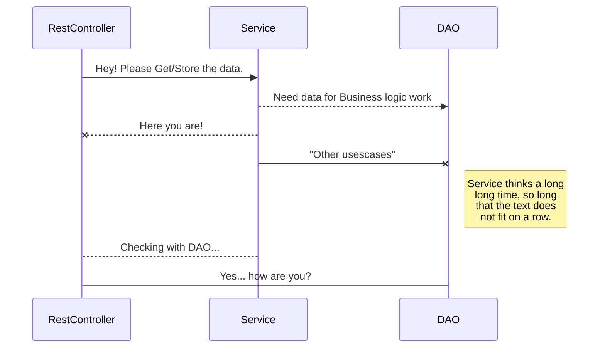
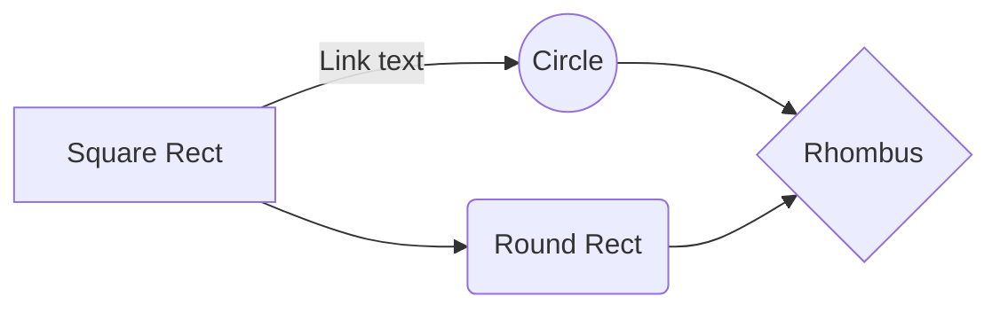

# README #

This README would normally document whatever steps are necessary to get your application up and running.

### What is this repository for? ###

* Quick summary
* Version
* [Learn Markdown](https://bitbucket.org/tutorials/markdowndemo)

### How do I get set up? ###

* Summary of set up
* Configuration
* Dependencies
* Database configuration
* How to run tests
* Deployment instructions

### Contribution guidelines ###

* Writing tests
* Code review
* Other guidelines

### Who do I talk to? ###

* Repo owner or admin
* Other community or team contact

######################################################################

# Welcome to TMS!
A Training Management System developed by **Metacube**

# Prerequisites
* Java 1.8
* MySQL 5.7
* Maven 3+
* Eclipse IDE with STS Plug-in

# Architecture
 - **Frameworks and Libraries**
	* Sprint Boot framework (version 2.0.5)
	* spring-boot-starter-data-jpa
	* spring-boot-starter-security
	* spring-boot-starter-web
	* spring-boot-devtools [Usability - **TBD**]
	* spring-boot-starter-actuator [Usability - **TBD**]
	* spring-boot-starter-tomcat
	* Spring Framework BeanUtils  [**TBD**]
	* mysql-connector-java
	* [lombok](https://projectlombok.org/features/Data)
		* Setter, Getters, Constructors, and Logger instance
		* [Install in eclipse](https://howtodoinjava.com/automation/lombok-eclipse-installation-examples/)
	* springfox-swagger2 - [Swagger UI](https://swagger.io/tools/swagger-ui/)
 - **Application Context** (DI/Bean configuration)
	- Annotation based (**default and used**)
	- [XML based](http://www.springboottutorial.com/spring-boot-java-xml-context-configuration)
	- [Java based](http://www.springboottutorial.com/spring-boot-java-xml-context-configuration)
  - **Database**
	* MySQL
		*  (**TBD** - create user with permissions in sql script for only project work)
 - **Server**
	* Embedded **Tomcat Web-server** (spring-boot-starter-tomcat)
- **Build/Package Management**
	- Important Maven commands
		- mvn –version -> Find the maven version
		- mvn compile -> compiles source files
		- mvn test-compile -> compiles test files - one thing to observe is this also compiles source files
		- mvn clean -> deletes target directory
		- mvn test -> run unit tests
		- mvn package -> creates a jar for the project
		- help:effective-settings -> Debug Maven Settings
		- help:effective-pom -> Look at the complete pom after all inheritances from parent poms are resolved
		- dependency:tree -> Look at all the dependencies and transitive dependencies
		- dependency:sources -> Download source code for all dependencies
		- –debug -> Debug flag. Can be used with all the above commands
	- Build Profiles (refer application-*.yaml) - (**TBD** - with POM profiles)
		- Dev
		- QA
		- Staging
		- Production
	- Setting Active Profile
		- Using -Dspring.profiles.active=prod/dev/qa/staging in VM Arguments
		- Use spring.profiles.active=prod/dev/qa/staging in application.yaml
	- Maven repository 
		- Local repository ? [**TBD**]
- **Security - Authentication/Authorization**
	- **TBD** - using [Sprint Security](https://www.baeldung.com/spring-boot-security-autoconfiguration), JWT, User Object, User Helper, Filter ?
- **Logging Framework**
	- Logback with SLF4j
	- refer **logback.xml** in project resources
	- Log Levels (**TBD** - defined per environment)
		- OFF (output no logs)
		- ERROR
		- WARN
		- INFO
		- DEBUG
		- TRACE
	- Log File Rotation
		-	[**TBD**  - test and update this, also add [profile part](https://dzone.com/articles/configuring-logback-with-spring-boot) ]
	- Example code
		- LOGGER.trace("Your log - {}", value);
		- LOGGER.debug("debug - {}", value);
		- LOGGER.info("info- {}", value);          
		- LOGGER.warn("warn - {}", value);          
		- LOGGER.error("error - {}", value);
- **Exception Handling**
	- HTTP Response/Error codes
		- 200 - SUCCESS
		- 404 - RESOURCE NOT FOUND
		- 400 - BAD REQUEST
		- 201 - CREATED
		- 401 - UNAUTHORIZED
		- 415 - UNSUPPORTED TYPE - Representation not supported for the resource
		- 500 - SERVER ERROR
- **Validation Layer** 
	- [**TBD** - [refer](http://www.springboottutorial.com/spring-boot-validation-for-rest-services)]
- **Rest API Response Object**
	- *[ResponseEntity](https://docs.spring.io/spring-framework/docs/current/javadoc-api/org/springframework/http/ResponseEntity.html)* class of Spring Framework
-  **DAO Layer**
	- JPA with Hibernate
	- Examples [TBD - for mapping 1-1, 1-m, m-m, m-1]
	- Audit Trails
		- Using Spring Data JPA Auditing - Audit Aware
		- [**TBD** - Auto creation of fields - CreatedBy, CreatedDate, LastModifiedBy, LastModifiedDate ]
	- Transaction Management [**TBD** ]
- **Database migration** [**TBD**]
	- Auto creation of db using the base entity objects + base schema sql + master data sql
	- Add and test maven mysql db migration plugin]
- **Unit & IT (Integration Testing)**
	- Mockito
	- JUnit
	- Code Coverage [**TBD** - check for report export]
- **Code versioning** [**TBD**]
	- set up **git** repository
	- Add steps for local setup
	- branching  code review process
	- set up git hooks for code commit format and validations
	- setup test-case execution using some CI_CD (travis-ci/circle-ci) for merge requests
	- show badge for build status on merge request for review and merging approval
- **API Documentation**
	- [Swagger](https://www.vojtechruzicka.com/documenting-spring-boot-rest-api-swagger-springfox/)
		- SpringFox swagger2
		- SpringFox swagger-ui
		- SpringFox bean-validators (**TBD**)
- **UML diagram - Multi Layered back-end**

- **Other areas** - [can be discussed and added]
	- REST guidelines
	- host on https ?
	- CICD
	- Eclipse settings for tabs, default developer profile and Javadocs
	- Do we need [spring data rest](https://projects.spring.io/spring-data-rest/) ? 
	- maven local repository ?
	- manage release - SNAPSHOT and prod
	- Multi module maven project architecture ?

----

**Additional documentation template** [not in use]
Table sample

SmartyPants converts ASCII punctuation characters into "smart" typographic punctuation HTML entities. For example:

|                |ASCII                          |HTML                         |
|----------------|-------------------------------|-----------------------------|
|Single backticks|`'Isn't this fun?'`            |'Isn't this fun?'            |
|Quotes          |`"Isn't this fun?"`            |"Isn't this fun?"            |
|Dashes          |`-- is en-dash, --- is em-dash`|-- is en-dash, --- is em-dash|

Flow chart sample

